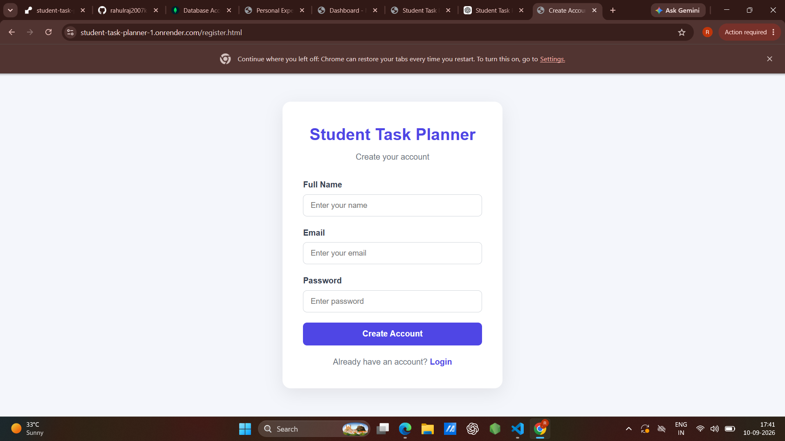
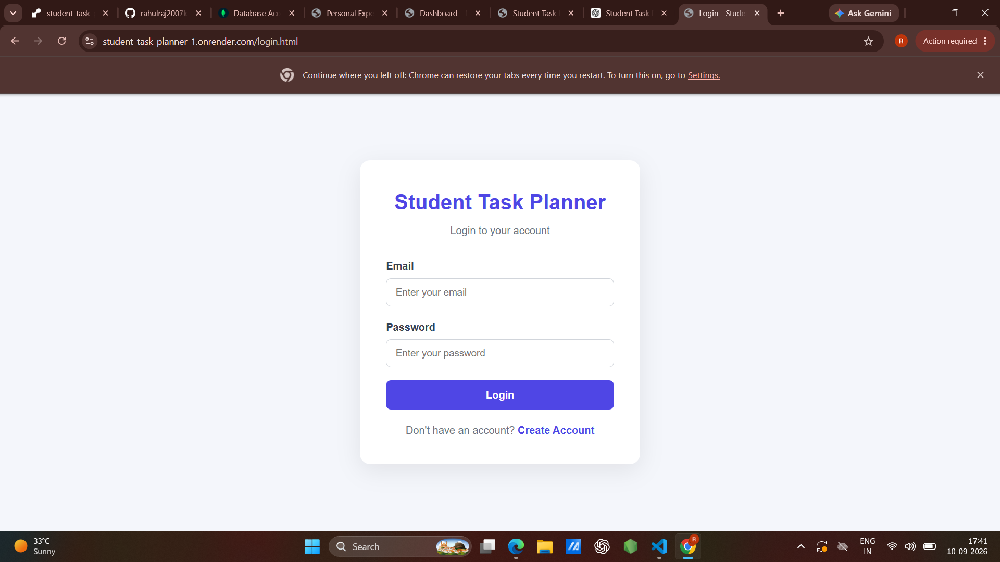
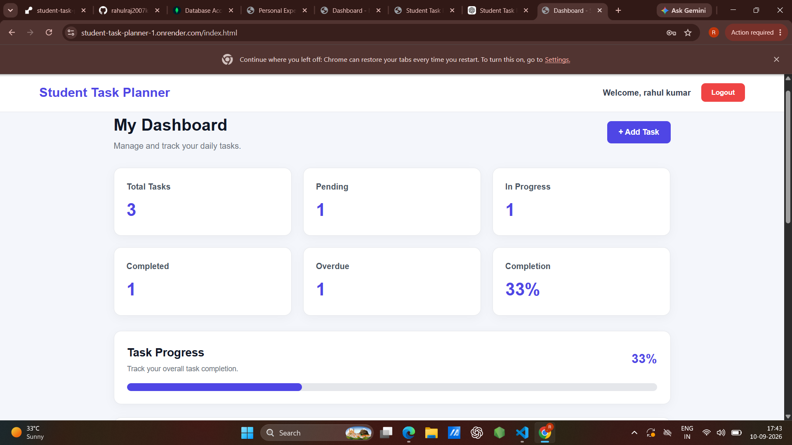
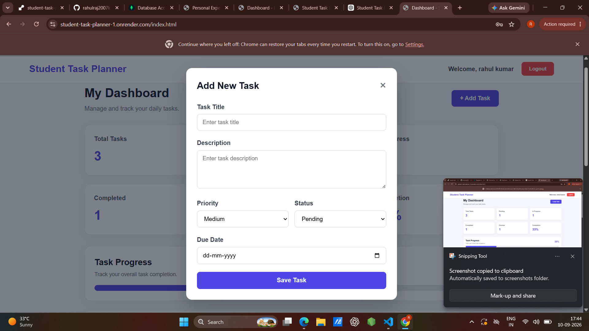
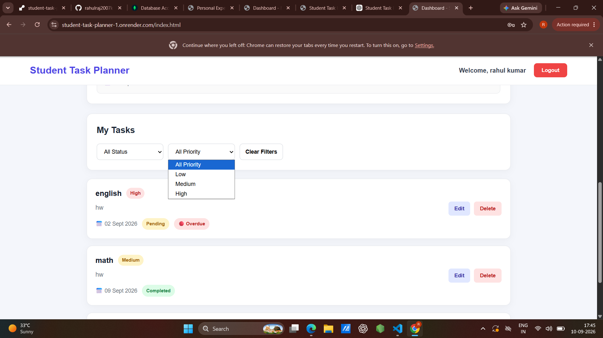
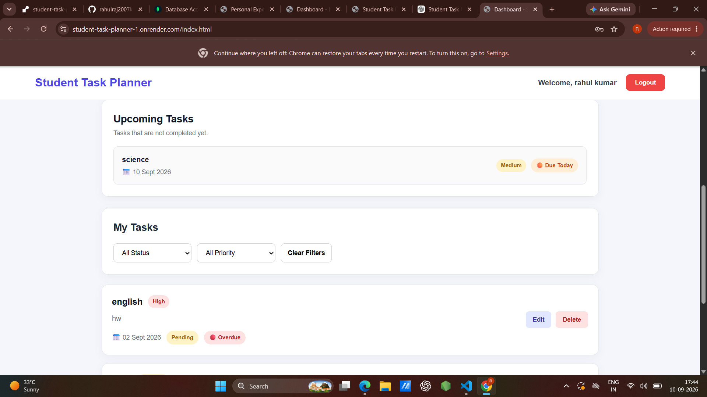

# Student Task Planner

A full-stack web application designed to help students create, manage, track, and organize their academic tasks efficiently.

## 🚀 Features

- User Registration and Login
- Secure password hashing using bcryptjs
- JWT-based authentication
- Create new tasks
- Edit existing tasks
- Delete tasks
- Task priorities:
  - Low
  - Medium
  - High
- Task statuses:
  - Pending
  - In Progress
  - Completed
- Filter tasks by status
- Filter tasks by priority
- Dashboard task summary
- Completion percentage
- Visual progress bar
- Upcoming task section
- Overdue task indicator
- Due Today indicator
- Due Soon indicator
- User-specific task management
- MongoDB database persistence
- Responsive dashboard design

## 🛠️ Technologies Used

### Frontend

- HTML5
- CSS3
- JavaScript
- Fetch API
- LocalStorage

### Backend

- Node.js
- Express.js
- MongoDB
- Mongoose
- JWT
- bcryptjs
- CORS
- dotenv

## 📁 Project Structure

```text
student-task-planner/
│
├── backend/
│   ├── config/
│   │   └── db.js
│   │
│   ├── controllers/
│   │   ├── authController.js
│   │   ├── dashboardController.js
│   │   └── taskController.js
│   │
│   ├── middleware/
│   │   └── authMiddleware.js
│   │
│   ├── models/
│   │   ├── User.js
│   │   └── Task.js
│   │
│   ├── routes/
│   │   ├── authRoutes.js
│   │   ├── dashboardRoutes.js
│   │   └── taskRoutes.js
│   │
│   ├── .env
│   ├── package.json
│   └── server.js
│
├── frontend/
│   ├── css/
│   │   └── style.css
│   │
│   ├── js/
│   │   ├── auth.js
│   │   └── dashboard.js
│   │
│   ├── index.html
│   ├── login.html
│   └── register.html
│
├── .gitignore
└── README.md
## Project Screenshots

### 1. Registration Page


### 2. Login Page


### 3. Dashboard


### 4. Add Task


### 5. My Tasks


### 6. Upcoming Tasks



